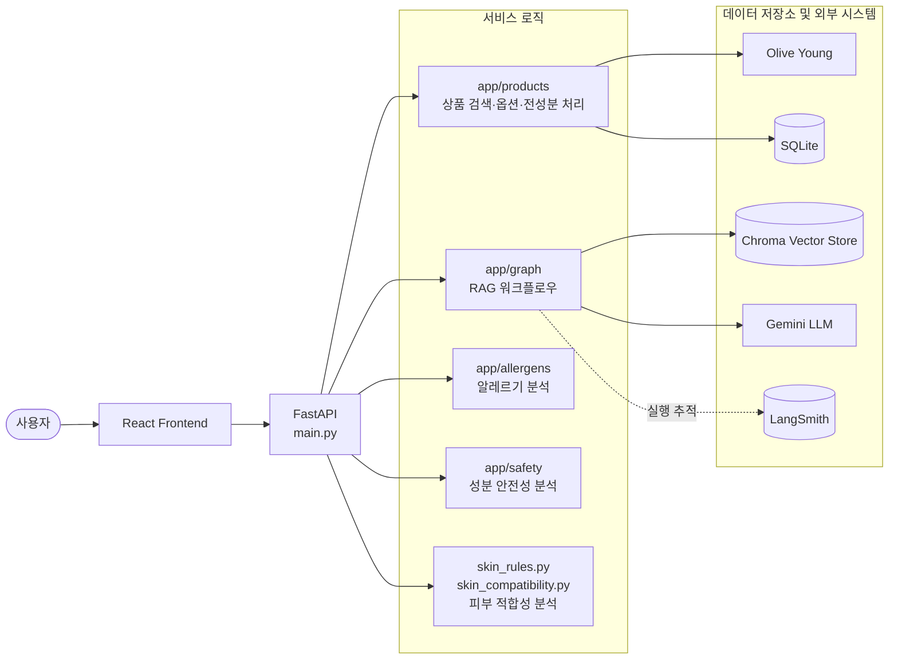
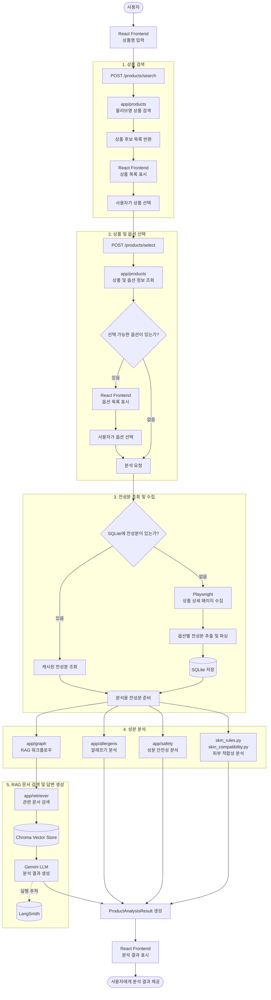

<h1 align="center">DermaRAG</h1>

<p align="center">
  화장품 상품의 전성분을 수집하고, 성분 및 규제 문서를 검색하여<br>
  사용자에게 분석 결과를 제공하는 LangGraph 기반 RAG 서비스입니다.
</p>

<p align="center">
  사용자는 올리브영 상품을 검색하고 원하는 상품과 옵션을 선택할 수 있습니다.<br>
  선택된 상품의 전성분은 자동으로 수집·정규화되며, SQLite에 캐싱된 데이터를 우선 활용하여<br>
  불필요한 브라우저 실행과 중복 수집을 줄입니다.
</p>

## 주요 기능

- 화장품 상품 검색
- 상품별 옵션 조회 및 선택
- 옵션별 전성분 수집 및 분리
- 전성분 데이터 정규화
- SQLite 기반 상품·옵션·전성분 캐싱
- 알레르기 유발 성분 분석
- 성분 안전성 분석
- 피부 타입별 성분 적합성 분석
- 화장품 성분 및 규제 문서 검색
- LangGraph 기반 RAG 답변 생성
- LangSmith 기반 실행 추적 및 평가
- FastAPI REST API
- React 기반 사용자 인터페이스

## 시스템 구성

DermaRAG는 FastAPI 백엔드와 React 프론트엔드로 구성됩니다.

FastAPI 백엔드에서는 상품 처리, RAG 검색, 알레르기 분석, 안전성 분석 및 피부 적합성 분석을 각각의 모듈로 분리해 처리합니다.



## 서비스 흐름

사용자는 상품명을 입력해 올리브영 상품을 검색하고, 분석할 상품과 옵션을 선택합니다.

상품의 전성분이 SQLite에 저장되어 있으면 캐시된 데이터를 사용하고, 데이터가 없으면 Playwright를 통해 상품 상세 페이지에서 전성분을 수집합니다.

준비된 전성분은 알레르기, 안전성, 피부 적합성 및 RAG 분석 모듈로 전달되며, 각각의 분석 결과를 통합해 사용자에게 제공합니다.



## 기술 스택

### Backend

- Python
- FastAPI
- Pydantic
- SQLAlchemy
- SQLite
- Playwright

### RAG 및 AI

- LangChain
- LangGraph
- LangSmith
- Gemini API
- Chroma

### Frontend

- React
- TypeScript

## 프로젝트 구조

```text
derma-rag/
├── app/
│   ├── allergens/                    # 알레르기 유발 성분 분석
│   ├── graph/                        # LangGraph 워크플로우
│   ├── products/                     # 상품 검색·전성분·SQLite 파이프라인
│   ├── safety/                       # 성분 안전성 분석
│   ├── services/                     # 비즈니스 로직
│   ├── config.py                     # 환경 설정
│   ├── database.py                   # SQLite 설정
│   ├── embeddings.py                 # 임베딩 모델
│   ├── langsmith_client.py           # LangSmith 설정
│   ├── main.py                       # FastAPI 진입점
│   ├── rag_chain.py                  # RAG 응답 생성
│   ├── retriever.py                  # 문서 검색
│   ├── schemas.py                    # API 스키마
│   ├── skin_compatibility.py         # 피부 적합성 분석
│   ├── skin_rule_schemas.py          # 피부 규칙 스키마
│   ├── skin_rules.py                 # 피부 타입별 판정 규칙
│   └── trace_metadata.py             # 추적 메타데이터
├── data/                             # 성분·규제 데이터
├── docs/                             # 상세 개발 문서
├── evals/                            # 평가 코드와 데이터
├── frontend/                         # React 프론트엔드
├── scripts/                          # 데이터 처리 스크립트
├── vectorstore/                      # Chroma 벡터 저장소
├── .env.example                      # 환경 변수 작성 예시
└── README.md                         # 프로젝트 전체 소개
```

## 상세 개발 문서

프로젝트의 데이터 구축 과정, RAG 파이프라인 설계, LangGraph 전환 과정과 상품 전성분 수집 파이프라인의 상세 구현 내용은 아래 문서에서 확인할 수 있습니다.

| 문서 | 주요 내용 |
|---|---|
| [식약처 성분·규제 데이터 구축](docs/mfds_regulation.md) | 식약처 화장품 성분·규제 데이터 수집, 정제, 문서 변환 및 벡터 저장소 구축 과정 |
| [LangChain 기반 RAG 구축](docs/LangChain.md) | 문서 검색, 정확 일치 검색, 중복 제거, 컨텍스트 구성, 프롬프트 생성 및 LLM 응답 생성 과정 |
| [LangGraph 기반 RAG 워크플로우](docs/LangGraph.md) | 기존 RAG 파이프라인을 상태 기반 그래프로 전환하고 노드와 실행 흐름을 구성한 과정 |
| [상품 전성분 처리 파이프라인](docs/Product_Ingredient_Pipeline.md) | 올리브영 상품 검색부터 옵션 선택, 전성분 추출·정규화, SQLite 캐싱 및 성분 분석까지의 전체 과정 |

## 실행 방법

### Backend

```bash
uv sync
uv run uvicorn app.main:app --reload --host 127.0.0.1 --port 8001
```

### Frontend

```bash
cd frontend
npm install
npm run dev
```