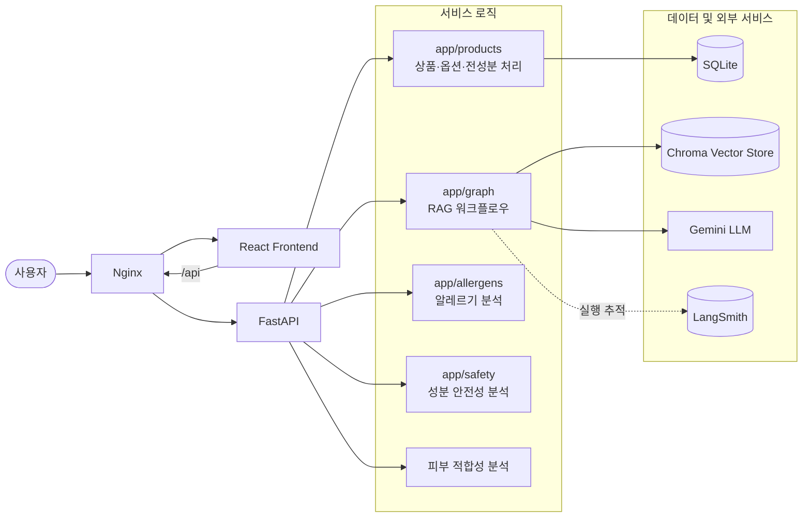

<h1 align="center">DermaRAG</h1>

<p align="center">
  화장품 상품의 전성분을 수집하고, 성분 및 규제 문서를 검색하여<br>
  사용자에게 분석 결과를 제공하는 LangGraph 기반 RAG 서비스입니다.
</p>

<p align="center">
  사용자는 올리브영 상품을 검색하고 원하는 상품과 옵션을 선택할 수 있습니다.<br>
  상품·옵션·전성분 데이터는 수집·정규화 후 SQLite에 캐싱되며,<br>
  배포 환경에서는 사전 구축된 캐시를 활용하여 안정적으로 분석을 제공합니다.
</p>

## 주요 기능

- 화장품 상품 검색
- 상품별 옵션 조회 및 선택
- 옵션별 전성분 수집 및 분리
- 전성분 데이터 정규화
- SQLite 기반 상품·옵션·전성분 캐싱
- 알레르기 유발 성분 분석
- 성분 안전성 분석
- 피부 타입별 성분 적합성 분석
- 화장품 성분 및 규제 문서 검색
- LangGraph 기반 RAG 답변 생성
- LangSmith 기반 실행 추적 및 평가
- FastAPI REST API
- React 기반 사용자 인터페이스

## 시스템 구성

DermaRAG는 React 프론트엔드, Nginx, Docker 기반 FastAPI 백엔드로 구성됩니다.

배포 환경에서는 Nginx가 React 정적 파일을 제공하고 /api 요청을 FastAPI로 전달합니다. FastAPI 백엔드는 상품 처리, RAG 검색, 알레르기 분석, 안전성 분석 및 피부 적합성 분석을 각각의 모듈로 분리해 처리합니다.



## 서비스 흐름

사용자는 상품명을 입력해 미리 수집된 올리브영 상품을 검색하고, 분석할 상품과 옵션을 선택합니다.

배포 환경에서는 SQLite에 저장된 상품·옵션·전성분 데이터를 우선 사용합니다. 필요한 상품 데이터는 로컬 환경에서 별도로 수집한 뒤 SQLite DB를 서버에 반영합니다.

준비된 전성분은 알레르기, 안전성, 피부 적합성 및 RAG 분석 모듈로 전달되며, 각 분석 결과를 통합하여 사용자에게 제공합니다.

```mermaid
flowchart TD
    USER([사용자]) --> INPUT["React Frontend<br/>상품명 입력"]

    %% =========================
    %% 1. 상품 검색
    %% =========================
    subgraph SG_SEARCH["1. 상품 검색"]
        SEARCH_API["POST /products/search"]
        SEARCH_CACHE{"SQLite에<br/>검색 가능한 상품이 있는가?"}
        PRODUCT_LIST["캐시된 상품 목록 반환"]
        SHOW_PRODUCTS["React Frontend<br/>상품 목록 표시"]
        SELECT_PRODUCT["사용자가 상품 선택"]
        NO_PRODUCT["미수집 상품 안내"]

        SEARCH_API --> SEARCH_CACHE
        SEARCH_CACHE -- 있음 --> PRODUCT_LIST
        PRODUCT_LIST --> SHOW_PRODUCTS
        SHOW_PRODUCTS --> SELECT_PRODUCT

        SEARCH_CACHE -- 없음 --> NO_PRODUCT
    end

    INPUT --> SEARCH_API

    %% =========================
    %% 2. 상품 및 옵션 선택
    %% =========================
    subgraph SG_SELECT["2. 상품 및 옵션 선택"]
        SELECT_API["POST /products/select"]
        PREPARE_PRODUCT["app/products<br/>캐시된 상품 및 옵션 정보 조회"]
        HAS_OPTION{"선택 가능한 옵션이 있는가?"}
        SHOW_OPTIONS["React Frontend<br/>옵션 목록 표시"]
        SELECT_OPTION["사용자가 옵션 선택"]
        REQUEST_ANALYSIS["분석 요청"]

        SELECT_API --> PREPARE_PRODUCT
        PREPARE_PRODUCT --> HAS_OPTION

        HAS_OPTION -- 있음 --> SHOW_OPTIONS
        SHOW_OPTIONS --> SELECT_OPTION
        SELECT_OPTION --> REQUEST_ANALYSIS

        HAS_OPTION -- 없음 --> REQUEST_ANALYSIS
    end

    SELECT_PRODUCT --> SELECT_API

    %% =========================
    %% 3. 전성분 조회
    %% =========================
    subgraph SG_INGREDIENT["3. 전성분 조회"]
        CHECK_CACHE{"SQLite에<br/>전성분이 있는가?"}
        READ_CACHE["캐시된 옵션별 전성분 조회"]
        PREPARE_INGREDIENT["분석용 전성분 준비"]
        ANALYSIS_UNAVAILABLE["분석 불가 안내"]

        CHECK_CACHE -- 있음 --> READ_CACHE
        READ_CACHE --> PREPARE_INGREDIENT

        CHECK_CACHE -- 없음 --> ANALYSIS_UNAVAILABLE
    end

    REQUEST_ANALYSIS --> CHECK_CACHE

    %% =========================
    %% 4. 성분 분석
    %% =========================
    subgraph SG_ANALYSIS["4. 성분 분석"]
        ALLERGEN["app/allergens<br/>알레르기 분석"]
        SAFETY_ANALYSIS["app/safety<br/>성분 안전성 분석"]
        SKIN_ANALYSIS["skin_rules.py<br/>skin_compatibility.py<br/>피부 적합성 분석"]
        RAG["app/graph<br/>RAG 워크플로우"]
    end

    PREPARE_INGREDIENT --> ALLERGEN
    PREPARE_INGREDIENT --> SAFETY_ANALYSIS
    PREPARE_INGREDIENT --> SKIN_ANALYSIS
    PREPARE_INGREDIENT --> RAG

    %% =========================
    %% 5. RAG
    %% =========================
    subgraph SG_RAG["5. RAG 문서 검색 및 답변 생성"]
        RETRIEVER["app/retriever<br/>관련 문서 검색"]
        CHROMA[("Chroma Vector Store")]
        LLM["Gemini LLM<br/>분석 결과 생성"]
        LANGSMITH[("LangSmith")]

        RETRIEVER --> CHROMA
        CHROMA --> LLM
        LLM -. 실행 추적 .-> LANGSMITH
    end

    RAG --> RETRIEVER

    ALLERGEN --> RESULT["ProductAnalysisResult 생성"]
    SAFETY_ANALYSIS --> RESULT
    SKIN_ANALYSIS --> RESULT
    LLM --> RESULT

    RESULT --> SHOW_RESULT["React Frontend<br/>분석 결과 표시"]
    SHOW_RESULT --> END([사용자에게 분석 결과 제공])

    %% =========================
    %% 별도 데이터 수집 파이프라인
    %% =========================
    subgraph SG_COLLECTION["상품 데이터 사전 수집 · 배포"]
        LOCAL["로컬 환경"]
        PLAYWRIGHT["Playwright<br/>올리브영 상품 상세 페이지 수집"]
        PARSE["옵션별 전성분 추출 및 파싱"]
        LOCAL_DB[("SQLite")]
        BACKUP["배포용 DB 생성<br/>sqlite .backup"]
        SERVER_DB[("EC2 SQLite")]

        LOCAL --> PLAYWRIGHT
        PLAYWRIGHT --> PARSE
        PARSE --> LOCAL_DB
        LOCAL_DB --> BACKUP
        BACKUP --> SERVER_DB
    end

    SERVER_DB -. 상품 / 옵션 / 전성분 제공 .-> SEARCH_CACHE
    SERVER_DB -. 전성분 제공 .-> CHECK_CACHE
```



## 기술 스택

### Backend

| 기술 | 역할 |
|---|---|
| Python | 백엔드 및 데이터 처리 |
| FastAPI | REST API 서버 |
| LangChain | RAG 파이프라인 구성 |
| LangGraph | 분석 워크플로우 상태 관리 |
| Google Gemini | 최종 분석 답변 생성 |
| SQLite | 상품·옵션·전성분 캐시 |
| Chroma | 성분·규제 문서 Vector Store |
| Playwright | 올리브영 상품 및 전성분 수집 |
| LangSmith | LangGraph/RAG 실행 추적 및 평가 |

### Frontend

| 기술 | 역할 |
|---|---|
| React | 사용자 인터페이스 |
| TypeScript | 타입 기반 프론트엔드 개발 |
| Vite | 개발 서버 및 Production Build |
| Tailwind CSS | UI 스타일링 |

### Infrastructure

| 기술 | 역할 |
|---|---|
| Docker | FastAPI 및 Playwright 실행 환경 구성 |
| Nginx | React 정적 파일 제공 및 `/api` Reverse Proxy |
| AWS EC2 | 서비스 배포 서버 |
| Playwright Chromium | 서버/로컬 브라우저 자동화 |
| Xvfb | Linux 서버에서 headed Chromium 실행 |

### Package Management

- Python: `uv`
- Frontend: `npm`

## 프로젝트 구조

```text
DermaRAG-Chatbot/
├── app/
│   ├── allergens/                    # 알레르기 유발 성분 분석
│   ├── graph/                        # LangGraph 기반 RAG 워크플로우
│   ├── products/                     # 상품 검색·옵션·전성분 수집 및 캐싱
│   ├── safety/                       # 성분 안전성 분석
│   ├── services/                     # 서비스 비즈니스 로직
│   ├── config.py                     # 환경변수 및 애플리케이션 설정
│   ├── database.py                   # SQLite 연결 및 설정
│   ├── embeddings.py                 # Embedding 모델 설정
│   ├── langsmith_client.py           # LangSmith 추적 설정
│   ├── main.py                       # FastAPI 애플리케이션 진입점
│   ├── rag_chain.py                  # RAG 응답 생성 로직
│   ├── retriever.py                  # Chroma 문서 검색
│   ├── schemas.py                    # API 요청·응답 스키마
│   ├── skin_compatibility.py         # 피부 적합성 분석
│   ├── skin_rule_schemas.py          # 피부 규칙 스키마
│   ├── skin_rules.py                 # 피부 타입별 판정 규칙
│   └── trace_metadata.py             # LangSmith 추적 메타데이터
│
├── data/
│   ├── derma_rag.db                  # 상품·옵션·전성분 SQLite 캐시
│
├── docs/                             # 개발 과정 및 트러블슈팅 문서
│
├── evals/                            # RAG / LangGraph 평가 코드 및 데이터
│
├── frontend/
│   ├── src/
│   │   ├── api/                      # FastAPI 통신
│   │   ├── components/               # React UI 컴포넌트
│   │   ├── hooks/                    # 상품 검색·분석 상태 로직
│   │   └── ...                       # 기타 프론트엔드 코드
│   ├── package.json
│   └── vite.config.ts
│
├── scripts/                          # 데이터 전처리 및 Vector Store 생성
│
├── vectorstore/
│   └── chroma/                       # Chroma Vector Store
│
├── Dockerfile                        # FastAPI + Playwright Docker 이미지
├── docker-entrypoint.sh              # Docker 컨테이너 실행 스크립트
├── .dockerignore                     # Docker build 제외 파일
├── .env.example                      # 환경변수 작성 예시
├── pyproject.toml                    # Python 프로젝트 및 의존성 설정
├── uv.lock                           # Python 의존성 lock file
└── README.md                         # 프로젝트 소개 및 실행 방법
```

## 상세 개발 문서

프로젝트의 데이터 구축 과정, RAG 파이프라인 설계, LangGraph 전환 과정과 상품 전성분 수집 파이프라인의 상세 구현 내용은 아래 문서에서 확인할 수 있습니다.

| 문서 | 주요 내용 |
|---|---|
| [식약처 성분·규제 데이터 구축](docs/mfds_regulation.md) | 식약처 화장품 성분·규제 데이터 수집, 정제, 문서 변환 및 벡터 저장소 구축 과정 |
| [LangChain 기반 RAG 구축](docs/LangChain.md) | 문서 검색, 정확 일치 검색, 중복 제거, 컨텍스트 구성, 프롬프트 생성 및 LLM 응답 생성 과정 |
| [LangGraph 기반 RAG 워크플로우](docs/LangGraph.md) | 기존 RAG 파이프라인을 상태 기반 그래프로 전환하고 노드와 실행 흐름을 구성한 과정 |
| [상품 전성분 처리 파이프라인](docs/Product_Ingredient_Pipeline.md) | 올리브영 상품 검색부터 옵션 선택, 전성분 추출·정규화, SQLite 캐싱 및 성분 분석까지의 전체 과정 |
| [데이터 수집 개선](docs/Data_Collection_Improvements.md) | 상품 데이터 수집·옵션 파싱 파이프라인 개선 및 안정화 |
| [AWS EC2 배포](docs/AWS_EC2_Deployment.md) | Docker, Nginx, SQLite 캐시 및 React를 포함한 AWS EC2 배포 과정과 주요 트러블슈팅 |


## 실행 방법

### 배포 환경

현재 DermaRAG는 AWS EC2에서 다음 구조로 실행됩니다.

```text
Browser
  ↓
Nginx :80
  ├─ React
  └─ /api/*
       ↓
Docker FastAPI :8001
  ├─ SQLite Cache
  └─ Chroma Vectorstore
```  

### 1. 환경변수 설정

프로젝트 루트의 `.env.example`을 참고하여 `.env` 파일을 생성합니다.

```bash
cp .env.example .env
```

필요한 API Key와 환경변수를 설정합니다.

```env
PLAYWRIGHT_HEADLESS=false
```

### 2. Backend

프로젝트 루트에서 Docker 이미지를 빌드합니다.

```bash
docker build -t derma-rag .
```

Chroma Vectorstore가 없는 경우 최초 1회 생성합니다.

```bash
mkdir -p vectorstore

docker run --rm \
  --init \
  --env-file .env \
  -v "$PWD/vectorstore:/app/vectorstore" \
  derma-rag \
  uv run --no-sync python -m scripts.ingest
```

백엔드 컨테이너를 실행합니다.

```bash
docker run -d \
  --name derma-rag \
  --init \
  --env-file .env \
  --restart no \
  -v "$PWD/data:/app/data" \
  -v "$PWD/vectorstore:/app/vectorstore" \
  -p 127.0.0.1:8001:8001 \
  derma-rag
```

실행 상태와 로그를 확인합니다.

```bash
docker ps
docker logs derma-rag
```

### 3. Frontend

배포 환경에서는 Nginx의 `/api` 경로를 통해 FastAPI에 접근합니다.

`frontend/.env.production`

```env
VITE_API_BASE_URL=/api
```

프론트엔드 의존성을 설치하고 production build를 생성합니다.

```bash
cd frontend
npm ci
npm run build
```

생성된 `dist` 파일을 Nginx 정적 파일 경로에 배포합니다.

```bash
sudo rm -rf /var/www/dermarag/*
sudo cp -r dist/* /var/www/dermarag/
```

### 4. Nginx

Nginx는 React 정적 파일을 제공하고 `/api` 요청을 FastAPI로 전달합니다.

```nginx
server {
    listen 80;
    server_name _;

    root /var/www/dermarag;
    index index.html;

    location / {
        try_files $uri $uri/ /index.html;
    }

    location /api/ {
        proxy_pass http://127.0.0.1:8001/;

        proxy_http_version 1.1;
        proxy_set_header Host $host;
        proxy_set_header X-Real-IP $remote_addr;
        proxy_set_header X-Forwarded-For $proxy_add_x_forwarded_for;
        proxy_set_header X-Forwarded-Proto $scheme;
    }
}
```

설정을 확인하고 Nginx를 실행합니다.

```bash
sudo nginx -t
sudo systemctl restart nginx
```

서비스는 EC2 Public IP를 통해 접속할 수 있습니다.

```text
http://<EC2_PUBLIC_IP>
```

## 로컬 개발

### Backend

```bash
uv sync
uv run playwright install chromium
uv run uvicorn app.main:app --reload --host 127.0.0.1 --port 8001
```

FastAPI Swagger UI:

```text
http://127.0.0.1:8001/docs
```

### Frontend

```bash
cd frontend
npm ci
npm run dev
```

Vite 개발 서버:

```text
http://localhost:5173
```